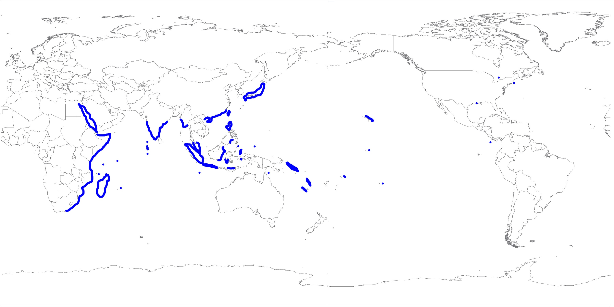
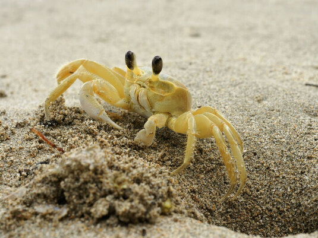

## Ghost Crab Background 
Ghost crabs are common shore crabs that live in tropical areas in the world. They inhabit burrows within intertidal zones and are scavengers and predators of small animals. 
```{r, echo=FALSE, out.width="75%", fig.cap="Ghost Crab Habitat"}

```


## Project Goals 
1. Load data from [Ghost Crab Burrow Morphology and Distribution](https://doi.org/10.6084/m9.figshare.6895109) 
2. Select and filter through burrow dimensions data 
3. Plot and graph selected data
<center>



</center>


## Required Packages for R
- Tidyverse
- Magrittr
- Knitr
```{r load-packages, fig.align='center', echo=TRUE}
library(magrittr)
library(knitr)
library(tidyverse)
```


## Part I
Import data from [Ghost Crab Burrow Morphology and Distribution](https://doi.org/10.6084/m9.figshare.6895109).
```{r,echo=FALSE, fig.align='center', cache=TRUE}
burrow_dimensions_raw <- read.csv("../Data/Ghost_crab_burrow_architecture.csv")
Burrow_tibble <- as_tibble(burrow_dimensions_raw[, 1:5])
Burrow_table <- head(Burrow_tibble)
knitr::kable(Burrow_table, 
             col.names = c('Site', 'Impact Types', 'Burrow Shape', 'Beach Slope', 'Sand Compaction'))
```


## Part II (a) 
Selecting and filtering for burrow **sites**, **depth**, **temperature**, and **month**.
```{r,echo=FALSE, fig.align='center', cache=TRUE}
burrow_site_depth_temp_month <- burrow_dimensions_raw %>%
  select(site, burrow.depth, burrow.temperature, month) %>%
  filter(site == "Debidue Island" | site == "Folly Beach " | site == "Pawleys Island 1" | site == "Edisto Beach")
selected_data_tibble <- as_tibble(burrow_site_depth_temp_month)
selected_data_table <- head(selected_data_tibble)
knitr::kable(selected_data_table, 
             col.names = c('Site', 'Burrow Depth (mm)', 'Burrow Temperature (°C)', 'Month'))
```


## Part II (b) 
Selecting and filtering for burrow **shape**, **sites**, and **temperature**.
```{r, echo=FALSE, fig.align='center'}
burrow_shape_temperature_sites <- burrow_dimensions_raw %>%
  select(site, burrow.shape, burrow.temperature) %>%
  filter(site == "Debidue Island" | site == "Folly Beach " | site == "Pawleys Island 1" | site == "Edisto Beach")
depth_temp_site_tibble <- as_tibble(burrow_shape_temperature_sites)
depth_temp_site_table<- head(depth_temp_site_tibble)
knitr::kable(depth_temp_site_table,
             col.names = c('Site', 'Burrow Shape', 'Burrow Temperature (°C)'))
```


## Part III (a)
Plotting burrow **sites** vs **depth** vs **temperature** vs **month**.
```{r, echo=FALSE, fig.align='center'}
burrow_data_plot <- ggplot(burrow_site_depth_temp_month, aes(x = burrow.depth, y = burrow.temperature,
  color = month)) +
  geom_point() +
  facet_wrap(~site) +
  geom_smooth(method = "loess") +
  labs(x = "Burrow Depth (mm)", y = "Burrow Temperature (°C)") +
  labs(title = "Burrow Depth vs Temperature") +
  theme(plot.title = element_text(hjust = 0.5))
print(burrow_data_plot)
```


## Part III (b)
Plotting burrow **sites** vs **shape** vs **temperature**.
```{r, echo=FALSE, fig.align='center'}
burrow_data_plot_2 <- ggplot(burrow_shape_temperature_sites, aes(x = burrow.shape, y = burrow.temperature, color = burrow.shape)) +
  geom_point() +
  geom_jitter() +
  facet_wrap(~site)+
  labs(x = "Burrow Shape", y = "Burrow Temperature (°C)") +
  labs(title = "Burrow Shape vs Temperature") +
  theme(plot.title = element_text(hjust = 0.5))
print(burrow_data_plot_2)
```


## Conclusion
Further analysis is needed to conclude any findings.


