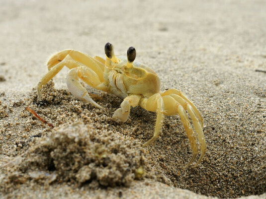
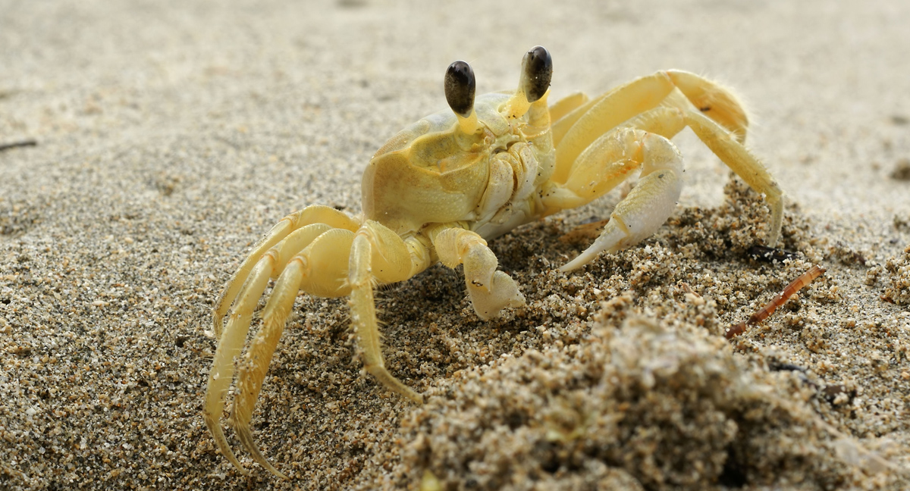

## Concept
- Ghost crab populations strongly decline under high human disturbance
    - Population size was a good indicator of effective beach management
- Are ghost crab burrows also a good indicator effective beach management?
```{r, echo=FALSE, out.width= "55%", out.extra='style="float:right; padding:10px"'}

```


## Project Goals 
1. Analyze ghost crab burrow [data](https://doi.org/10.6084/m9.figshare.6895109) 
    - Collected in South Carolina between May and Sept. of 2016
2. Determine if there is a correlation between burrow dimensions and human disturbance
3. Present findings in a way that is understandable


## Required Packages
- Tidyverse
- Knitr
```{r load-packages, echo=FALSE, cache=TRUE}
library(knitr)
library(tidyverse)
```


## Importing Data
Data used in analysis comes from three datasets:  

1. [Burrow size among impact types](https://figshare.com/articles/Impacts_of_human_disturbance_on_ghost_crab_burrow_morphology_and_distribution_on_sandy_shore/6895109/1?file=12581102) 

2. [Burrow density among impact types](https://figshare.com/articles/Impacts_of_human_disturbance_on_ghost_crab_burrow_morphology_and_distribution_on_sandy_shore/6895109/1?file=12581114) 

3. [Burrow architecture](https://figshare.com/articles/Impacts_of_human_disturbance_on_ghost_crab_burrow_morphology_and_distribution_on_sandy_shore/6895109/1?file=12581108)

```{r, echo=FALSE, out.width= "40%", out.extra='style="float:right"'}
knitr::include_graphics("../Images/Slide Images/South_Carolina_Beaches.jpg")
```


## Important Information
Information needed to interpret graphs

Variables

- HI: High human impact
- HV: High human and vehicle impact
- MI: Moderate human impact
- P: Pristine sites (little to no human impact)


# Part I
Looking at human impact on burrow opening diameter

## Opening Diameter vs. Impact
Filtering and selecting data
```{r,echo=FALSE, message=FALSE, fig.align='center', cache=TRUE}
#Reading in data
burrow_raw_data <- read.csv("../Data/Ghost_crab_burrow_architecture.csv")
#Selecting data
diameter_impact <- burrow_raw_data %>%
  arrange(desc(average.burrow.diameter)) %>%
  select(site, average.burrow.diameter, impact.types)
#Showing tibble table
diameter_impact_tibble <- as_tibble(diameter_impact)
diameter_impact_table <- head(diameter_impact_tibble)
knitr::kable(diameter_impact_table, align = "lrr",
             col.names = c('Site', 'Opening Diameter (mm)', 'Impact Type'))
```

## Opening Diameter vs. Impact
Graphing data
```{r,echo=FALSE, message=FALSE, fig.align='center', cache=TRUE}
#Selecting data to graph
diameter_average <- diameter_impact %>% 
  group_by(impact.types) %>%
  summarise(avg = median(average.burrow.diameter)) 
Diam_avg <- data.frame(diameter_average) %>%
  arrange(desc(impact.types))
#Creating bar plot
diam_avg_plot <- ggplot(Diam_avg, 
                        aes(x = reorder(impact.types, -avg), 
                            y = avg, fill = impact.types)) +
  geom_bar(stat = "identity", alpha = 0.4) +
  theme_bw() + 
  theme(panel.grid.major = element_blank(), 
        panel.grid.minor = element_blank(), 
        panel.border = element_blank(), 
        axis.line = element_line()) +
  ggtitle("Opening Diameter (mm) vs Human Impact") +
  theme(plot.title = element_text(hjust = 0.9)) +
  labs(y="Average Diameter (mm)", 
       x = "Human Impact") +
  geom_errorbar(aes(ymin = avg, ymax = avg), 
                color = "#22292F", width = .3) +
  scale_y_continuous(expand = c(0, 0))
#Plot graph
plot(diam_avg_plot)
```


# Part II
Looking at human impact on burrow density 

## Density vs. Impact
Filtering and selecting data
```{r,echo=FALSE, message=FALSE, fig.align='center', cache=TRUE}
#Reading in data
burrow_density_raw_data <- read.csv("../Data/Burrow_density_impact_types.csv")
#Selecting data
density_impact <- burrow_density_raw_data %>%
  arrange(desc(burrow.density)) %>%
  select(site, impact.types, burrow.density)
#Showing tibble table
density_impact_tibble <- as_tibble(density_impact)
density_impact_table <- head(density_impact_tibble)
knitr::kable(density_impact_table, 
             col.names = c('Site', 'Impact Type', 'Burrow Density m^-2'))
#Selecting data to graph
density_average <- density_impact %>% 
  group_by(impact.types) %>%
  summarise(avg = median(burrow.density)) 
Dens_avg_df <- data.frame(density_average) %>%
  arrange(desc(impact.types))
```

## Density vs. Impact
Graphing data

```{r,echo=FALSE, message=FALSE, fig.align='center', cache=TRUE}
#Creating bar plot
dens_avg_plot <- ggplot(Dens_avg_df, 
                        aes(x = reorder(impact.types, -avg), 
                            y = avg, fill = impact.types)) +
  geom_bar(stat = "identity", alpha = 0.4) +
  theme_bw() + 
  theme(panel.grid.major = element_blank(), 
        panel.grid.minor = element_blank(), 
        panel.border = element_blank(), 
        axis.line = element_line()) +
  ggtitle("Burrow Density (m^-2) vs Human Impact") +
  theme(plot.title = element_text(hjust = 0.9)) +
  labs(y="Burrow Density (m^-2)", 
       x = "Human Impact") +
  geom_errorbar(aes(ymin = avg, ymax = avg), 
                color = "#22292F", width = .3) +
  scale_y_continuous(expand = c(0, 0))
#Plot graph
plot(dens_avg_plot)
```


# Part III
Looking at human impact on burrows as they get closer to human development.


## Burrow Size vs. Quadrat
Graphing data
```{r, echo=FALSE, message=FALSE, fig.align='center', cache=TRUE}
#Reading in data
size_impact_raw_data <- read.csv("../Data/Burrow_ size_impact_types.csv")
#Selecting data
size_impact <- size_impact_raw_data %>%
  group_by(quadrat, impact.types) %>%
  summarise(avg = median(burrow.size))
 #Creating bar plot
size_avg_plot <- ggplot(size_impact) +
  geom_bar(aes(x = reorder(quadrat, -avg), 
                            y = avg, fill = impact.types),
           stat = "identity", position = "dodge", alpha = 0.4) +
  theme_bw() + 
  theme(panel.grid.major = element_blank(), 
        panel.grid.minor = element_blank(), 
        panel.border = element_blank(), 
        axis.line = element_line()) +
  ggtitle("Burrow Size (mm) vs Human Impact") +
  theme(plot.title = element_text(hjust = 0.5)) +
  labs(y="Burrow Size (mm)", 
       x = "Quadrat") +
  scale_y_continuous(expand = c(0, 0))
#Plot graph
plot(size_avg_plot)
```

## Burrow Density vs. Quadrat
```{r, echo=FALSE, message=FALSE, fig.align='center', cache=TRUE}
#Reading in data
density_quadrat_raw <- read.csv("../Data/Burrow_density_impact_types.csv")
#Selecting data
density_quadrat <- density_quadrat_raw %>%
  group_by(quadrat, impact.types) %>%
  summarise(avg = median(burrow.density))
#Creating bar plot
density_quadrat_plot <- ggplot(density_quadrat, 
                               aes(x = reorder(quadrat, -avg), 
                                   y = avg, fill = impact.types)) +
  geom_bar(stat = "identity", position = "dodge", alpha = 0.4) +
  theme_bw() + 
  theme(panel.grid.major = element_blank(), 
        panel.grid.minor = element_blank(), 
        panel.border = element_blank(), 
        axis.line = element_line()) +
  ggtitle("Burrow Density (m^-2) vs Human Impact") +
  theme(plot.title = element_text(hjust = 0.5)) +
  labs(y="Burrow Density (m^-2)", 
       x = "Quadrat") +
  scale_y_continuous(expand = c(0, 0))
#Plot graph
plot(density_quadrat_plot)
```

# Conclusion
What can we conclude based off these graphs?

## Conclusion
```{r, echo=FALSE, message=FALSE, figures-side, fig.show="hold", out.width="50%"}
plot(diam_avg_plot)
plot(dens_avg_plot)
plot(size_avg_plot)
plot(density_quadrat_plot)
```

## Conclusion

1. Even small human impacts can cause a change in ghost crab burrow dimensions

2. This burrowing behavior change makes studying Ghost Crab burrows an effective determinant of beach management


# Questions?
```{r, echo=FALSE, out.width="99%"}

```


