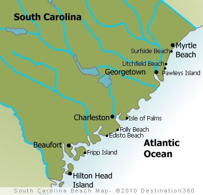

## Concept
- Ghost crab population size declines under high human impact
  - Respond strongly to impacts so good indicator of effective beach management
- Human impact on burrow dimensions is still being debated
  - Data was collected to determine this impact
```{r, echo=FALSE, out.width="45%"}

```


## Project Goals 
1. Load data from [Ghost Crab Burrow Morphology and Distribution](https://doi.org/10.6084/m9.figshare.6895109) 
2. Analyze human impact on ghost crab burrow dimensions and architecture
3. Present findings/data in a way that is clean and understandable


## Required Packages
- Tidyverse
- Magrittr
- Knitr
```{r load-packages, echo=FALSE}
library(magrittr)
library(knitr)
library(tidyverse)
```


## Importing Data
[Ghost Crab Burrow Morphology and Distribution](https://doi.org/10.6084/m9.figshare.6895109) data was collected in South Carolina between May and Sept. of 2016.
```{r,echo=FALSE, fig.align='center', cache=TRUE}
burrow_raw_data <- read.csv("../Data/Ghost_crab_burrow_architecture.csv")
Burrow_tibble <- as_tibble(burrow_raw_data[, 1:5])
Burrow_table <- head(Burrow_tibble)
knitr::kable(Burrow_table, 
             col.names = c('Site', 'Impact Types', 'Burrow Shape', 'Beach Slope', 'Sand Compaction'))
```


## Filtering and Selecting Data
Opening diameter and impact types
```{r,echo=FALSE, fig.align='center', cache=TRUE}
diameter_impact <- burrow_raw_data %>%
  select(site, average.burrow.diameter, impact.types)
diameter_impact_tibble <- as_tibble(diameter_impact)
diameter_impact_table <- head(diameter_impact_tibble)
knitr::kable(diameter_impact_table, 
             col.names = c('Site', 'Opening Diameter (mm)', 'Impact Type'))
```


## Filtering and Selecting Data
Burrow density and impact types


